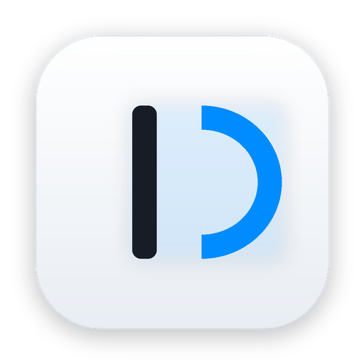

# Deck 🚀

> **A native, blazingly fast macOS efficiency platform for geeks & developers.**  
> Unifying **Multitouch Trackpad Gestures**, **Multi-Environment Hosts Switcher**, and an **Instant HUD App Switcher**.

<p align="center">
  
</p>

<p align="center">
  <a href="https://github.com/ztiandan/Deck/releases"></a>
  
  
  
  
</p>

---

## 🌟 Core Pillars

### 1. 🖐 Advanced Trackpad Gesture Engine
Directly bridges to macOS hardware touch frame streams with sub-millisecond latency, state-machine detection, and debounce cooldown:
- **TipTap Right (2 Fingers Fix)** ➔ `⌘ W`: Hold 1 finger left, tap 1 finger right — close active browser tab or window instantly.
- **TipTap Left (2 Fingers Fix)** ➔ `⌘ R`: Hold 1 finger right, tap 1 finger left — reload current page.
- **TipTap Left (3 Fingers Fix)** ➔ `^ ⇧ →`: Hold 2 fingers, tap leftmost finger — switch to previous tab/desktop.
- **TipTap Right (3 Fingers Fix)** ➔ `^ →`: Hold 2 fingers, tap rightmost finger — switch to next tab/desktop.
- **4-Finger Tap** ➔ `CMD(⌘) + Click`: Tap with 4 fingers simultaneously — open link in background tab.
- **Menubar Quick Toggle**: Pause or resume gesture monitoring at any time directly from the menubar.

### 2. 🌐 Multi-Environment Hosts Management
- **Instant Status Bar Switching**: Switch between `Default`, `Development`, `Testing`, and `Production` profiles with a single click.
- **Folders & Mutually Exclusive Groups**: Organize profiles into logical folders with optional mutual exclusion (allowing only one profile active per group).
- **🚀 Passwordless Writing Mode**: One-click authorization enables zero-prompt, zero-delay writes to `/etc/hosts` (< 1ms).
- **Native Code Editor & System Inspector**: Built-in monospaced editor with syntax highlighting, adaptive Light & Dark themes, live `/etc/hosts` overview, and silent DNS cache flushing (`dscacheutil` & `mDNSResponder`).

### 3. ⚡️ Instant HUD App Switcher & Palette
- **Global Single-Key Summoning**: Trigger a translucent, native HUD palette anywhere on screen with a single key (e.g., `F18`, easily mapped from `CapsLock` via Karabiner).
- **Keystroke Direct Activation**: Single key presses instantly switch to designated applications (e.g., `c` for Google Chrome, `v` for Visual Studio Code, `|` to cycle back to the previous application).
- **Mechanical Keycap 2.0 Aesthetic**: Refined physical keycap appearance, instant search filtering, and custom app binding support.

---

## 🎨 Design & Craftsmanship

- **Modern Light-Aesthetic Icon**: Sculpted arctic silver base featuring a geometric gradient azure "D-Glyph" engineered for macOS Sonoma & Sequoia.
- **Unified Clean UI**: Built purely in SwiftUI and AppKit with zero unnecessary focus rings, full-width responsive row targets, and smooth hover feedback.
- **Multilingual Support**: English by default, with seamless Chinese (简体中文) localization toggleable in General Preferences.
- **Window Management**: Global `⌘ W` and `Esc` keyboard shortcuts throughout the application for rapid dismissal.

---

## 🚀 Download & Installation

### Option 1: Direct Download (Recommended)
Pre-built release packages are automatically published on every GitHub commit:
1. Visit the **[GitHub Releases Page](https://github.com/ztiandan/Deck/releases)** and download **`Deck-macOS.zip`**.
2. Unzip the downloaded file to obtain `Deck.app`.
3. Drag `Deck.app` into your `/Applications` directory and launch it!

> [!NOTE]
> If macOS displays a Gatekeeper security warning on first launch, right-click (or Control-click) `Deck.app` and choose **Open**, or run:
> ```bash
> xattr -cr /Applications/Deck.app
> ```

### Option 2: Build from Source
```bash
# 1. Clone the repository
git clone https://github.com/ztiandan/Deck.git
cd Deck

# 2. Run the automated build and codesign script
./scripts/build_app.sh

# 3. Launch Deck
open Deck.app
```

---

## ⚙️ Initial Permissions

Deck requires standard macOS Accessibility permissions for global key listener and trackpad event simulation:
1. On first launch, follow the system prompt to allow **Deck** under **System Settings -> Privacy & Security -> Accessibility**.
2. In Deck's **General Settings**, click **"Enable Passwordless"** once to enable seamless `/etc/hosts` synchronization without repeated password prompts.

---

## 📂 Project Architecture

```
Deck/
├── Package.swift               # SwiftPM configuration
├── Resources/
│   ├── AppIcon.icns            # macOS multi-resolution icon bundle
│   ├── AppIcon.png             # High-res preview image
│   └── Info.plist              # Bundle metadata & LSUIElement background agent config
├── Sources/
│   └── Deck/
│       ├── App/                # Application lifecycle (AppDelegate, main)
│       ├── Core/               # Core engines
│       │   ├── Hosts/          # Hosts parser, merger, privileged writer, DNS flush
│       │   ├── Localization/   # Localization manager (English / Chinese)
│       │   ├── Palette/        # Hotkey listener, config store, app activator
│       │   └── Touchpad/       # Multitouch bridge, TipTap state machine, CGEvent
│       └── UI/                 # Native SwiftUI interfaces
│           ├── Hosts/          # Profile editor, system overview, preferences
│           ├── Palette/        # HUD popup & key mapping settings
│           ├── Touchpad/       # Trackpad gesture configuration
│           ├── MainContainerView.swift    # Unified sidebar layout
│           ├── MainWindowController.swift # Preference window controller
│           └── MenuBarManager.swift       # Menubar status tray controller
└── scripts/
    ├── build_app.sh            # Automated build, bundle & codesign script
    └── generate_icon.py        # Light-toned squircle icon generator
```

---

## 💾 Configuration Storage

User configurations are safely stored in your user's `Application Support` directory, persisting across updates:
- `~/Library/Application Support/Deck/config.json` (Palette key mappings)
- `~/Library/Application Support/Deck/hosts_config.json` (Hosts profiles and groups)
- `~/Library/Application Support/Deck/gestures.json` (Trackpad gesture rules)

---

## 📄 License

This project is licensed under the [MIT License](LICENSE).
